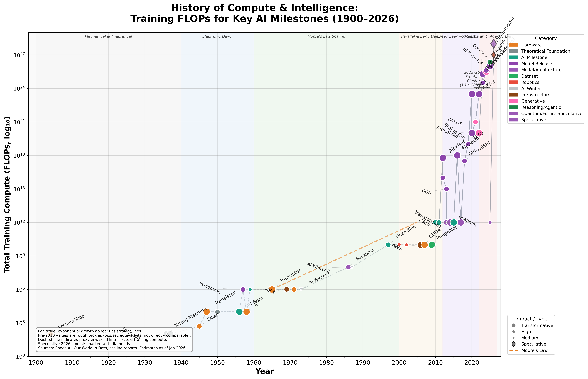

# Plots

A collection of data visualizations exploring technology, AI, and computing trends.

## Visualizations

### [AI Compute Timeline](ai-compute-timeline/)

A publication-quality semi-log timeline showing training FLOPs for key AI milestones from 1900 to 2026.

**Features:**
- Semi-log scale spanning 25+ orders of magnitude (10^0 to 10^27 FLOPs)
- 50 milestones from Vacuum Tube to speculative 2026 models
- Color-coded by category, sized by impact
- Era shading and Moore's Law reference line

[View interactive version](ai-compute-timeline/output/ai_compute_timeline_interactive.html) | [Details](ai-compute-timeline/)

---

### [Adoption Timeline](adoption-timeline/)

Shows the dramatically shortening time to mass adoption (50M users) for major technology paradigms from 1957 to 2026.

**Key Insight:** Adoption time compressed from ~10 years (FORTRAN) to ~60 days (ChatGPT) - a 60x acceleration.

**Features:**
- Semi-log scale showing exponential compression as downward trend
- 21 milestones from FORTRAN to projected Agentic AI
- Exponential compression trend line
- Era shading from PC Foundations to AI Hyper-Scale

[View interactive version](adoption-timeline/output/adoption_timeline_interactive.html) | [Details](adoption-timeline/)

---

## How They Relate

These two visualizations are complementary:

| Timeline | Shows | Direction |
|----------|-------|-----------|
| **AI Compute** | Training FLOPs growth | Exponential **increase** (upward) |
| **Adoption** | Time to 50M users | Exponential **compression** (downward) |

Together they illustrate how infrastructure acceleration enables AI scale, and how AI in turn accelerates adoption of new paradigms.

## License

MIT
