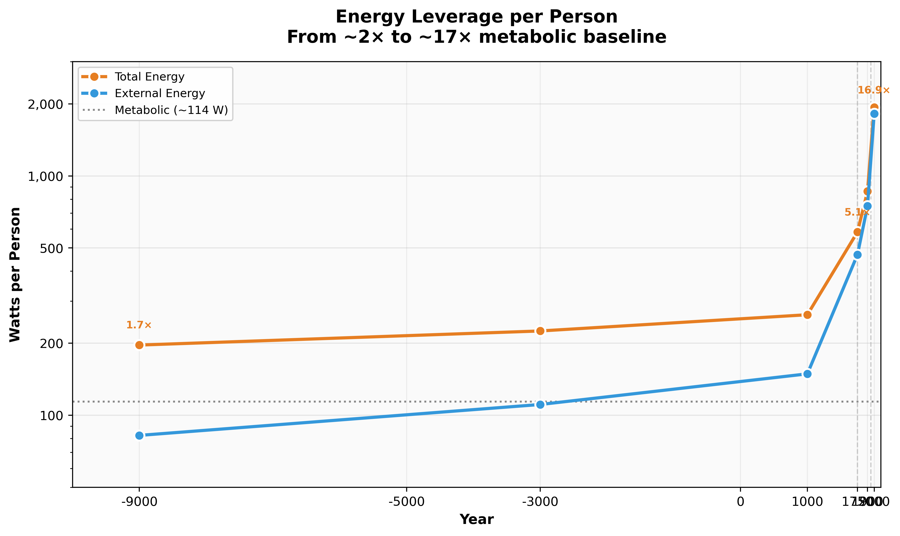

# Energy Leverage per Person

How much total energy does an average human command per year, compared to the metabolic baseline?



## Interactive Version

Open [`output/energy_leverage_interactive.html`](output/energy_leverage_interactive.html) for hover details on each era.

## The Key Insight

Humans went from **~1–2× body energy** (foragers burning wood) to **~17× body energy** (modern average).

| Era | Year | Total (W) | Multiplier |
|-----|------|-----------|------------|
| Foragers | -9000 | ~196 W | 1.7× |
| Early agrarian | -3000 | ~225 W | 2.0× |
| Pre-industrial | 1750 | ~583 W | 5.1× |
| Industrial | 1900 | ~862 W | 7.6× |
| Modern | 2000 | ~1,933 W | **16.9×** |

The **post-1750** (coal/steam) and **post-1950** (oil/electricity) jumps dominate the visual story.

## Metric Definitions

- **E_total** = total energy consumption per person (GJ/person/year)
- **E_metabolic** = 3.6 GJ/person/year (human food energy baseline)
- **E_external** = E_total - E_metabolic (energy from external sources)
- **Multiplier** = E_total / E_metabolic
- **Watts** = continuous power equivalent: `W = (GJ × 10⁹) / seconds_per_year`

## Data Sources

- **Nature synthesis paper**: Per-capita energy anchors across Holocene intervals
- **Smil (2017)**: Metabolic baseline (~3.6 GJ/person/year) from *Energy and Civilization*

## Usage

```bash
pip install matplotlib pandas plotly

# Static charts (PNG, SVG)
cd src && python energy_leverage.py

# Interactive HTML
cd src && python energy_leverage_plotly.py
```

## Related Visualizations

- [Energetic Scaling](../energetic-scaling/) – Biology vs. tech efficiency
- [Civilization Scaling](../civilization-scaling/) – Multi-lane timeline including energy

## License

MIT
